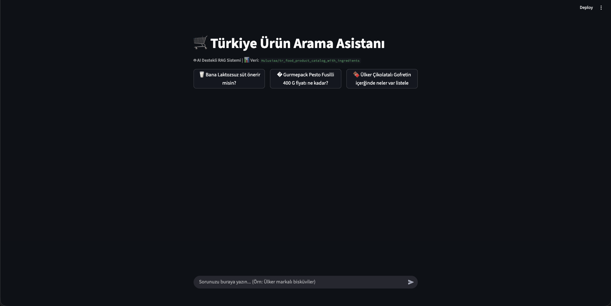
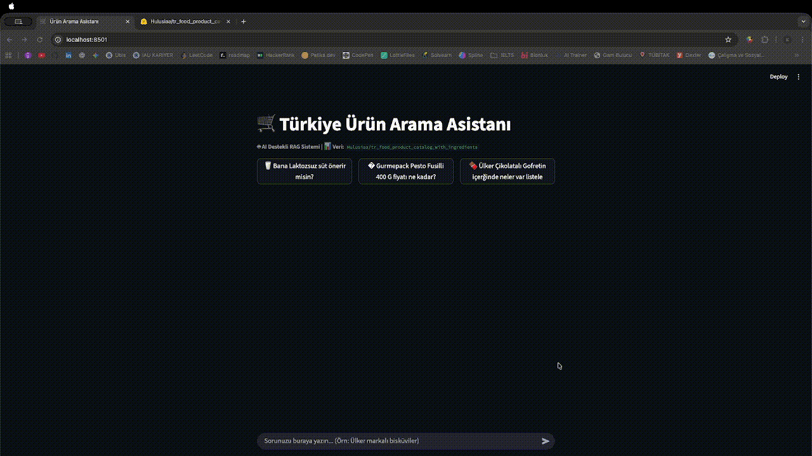

# 🛒 Türkiye Ürün Kataloğu Arama Asistanı

Bu proje, Türkiye'deki gıda ürünlerini arayabileceğiniz ve sorular sorabileceğiniz akıllı bir asistan uygulamasıdır. Haystack AI framework'ü ve Google Gemini AI modeli kullanılarak geliştirilmiştir.

**Demo Link**: 

## 📸 Uygulama Görselleri

### Ana Sayfa


### Demo - Canlı Kullanım
rkiye Ürün Kataloğu Arama Asistanı

Bu proje, Türkiye'deki gıda ürünlerini arayabileceğiniz ve sorular sorabileceğiniz akıllı bir asistan uygulamasıdır. Haystack AI framework'ü ve Google Gemini AI modeli kullanılarak geliştirilmiştir.


## 📋 İçindekiler

- [Özellikler](#özellikler)
- [Teknolojiler](#teknolojiler)
- [Kurulum](#kurulum)
- [Kullanım](#kullanım)
- [Proje Yapısı](#proje-yapısı)
- [API Anahtarları](#api-anahtarları)
- [Örnek Sorgular](#örnek-sorgular)

## ✨ Özellikler

- 🔍 **Akıllı Ürün Arama**: Doğal dil ile ürün arama
- 🤖 **AI Destekli Yanıtlar**: Google Gemini 2.0 Flash modeli ile güçlü yanıtlar
- 📊 **Kapsamlı Veri**: Hugging Face'ten gelen binlerce Türk gıda ürünü
- 💬 **Sohbet Arayüzü**: Streamlit ile kullanıcı dostu chat interface
- 🚀 **Hızlı Arama**: Vektör tabanlı semantic search
- 🏷️ **Detaylı Bilgi**: Fiyat, marka, kategori, içindekiler ve daha fazlası

## 🛠️ Teknolojiler

### Backend & AI
- **Haystack AI**: RAG (Retrieval-Augmented Generation) pipeline
- **Google Gemini 2.0 Flash**: Dil modeli
- **Sentence Transformers**: Türkçe embedding model (`trmteb/turkish-embedding-model`)
- **FAISS**: Vektör similarity search

### Frontend & Data
- **Streamlit**: Web arayüzü
- **Pandas**: Veri manipülasyonu
- **Hugging Face Datasets**: Veri kaynağı

### Veri Kaynağı
- **Dataset**: `Hulusiaa/tr_food_product_catalog_with_ingredients`
- **İçerik**: Türk gıda ürünleri kataloğu
- **data**: 

## 🚀 Kurulum

### 1. Projeyi İndirin
```bash
git clone <repository-url>
cd IntoToAI
```

### 2. Sanal Ortam Oluşturun
```bash
python -m venv venv
source venv/bin/activate  # Mac/Linux
# veya
venv\Scripts\activate     # Windows
```

### 3. Gerekli Paketleri Yükleyin
```bash
pip install -r requirements.txt
```

### 4. Çevre Değişkenlerini Ayarlayın
`.env` dosyası oluşturun:
```env
GOOGLE_API_KEY=your_google_api_key_here
HF_TOKEN=your_huggingface_token_here  # İsteğe bağlı
```

### 5. Uygulamayı Çalıştırın
```bash
streamlit run app.py
```

Uygulama varsayılan olarak `http://localhost:8501` adresinde çalışacaktır.

## 🔑 API Anahtarları

### Google API Key (Zorunlu)
1. [Google AI Studio](https://aistudio.google.com/)'ya gidin
2. API key oluşturun
3. `.env` dosyasına `GOOGLE_API_KEY` olarak ekleyin

### Hugging Face Token (İsteğe Bağlı)
1. [Hugging Face](https://huggingface.co/)'te hesap oluşturun
2. Settings > Access Tokens'dan token oluşturun
3. `.env` dosyasına `HF_TOKEN` olarak ekleyin

## 💡 Kullanım

### Örnek Sorgular

#### Ürün Arama
```
"Laktozsuz süt önerir misin?"
"Çikolatalı bisküviler neler var?"
```

#### Marka Bazlı Sorgular
```
"Ülker markasının ürünleri neler?"
```

#### İçerik Bazlı Sorgular
```
"Glütensiz ürünler var mı?"
```

## 📁 Proje Yapısı

```
IntoToAI/
├── app.py                 # Ana uygulama dosyası
├── requirements.txt       # Python bağımlılıkları
├── .env                   # Çevre değişkenleri
├── .gitignore            # Git ignore dosyası
├── README.md             # Bu dosya
└── venv/                 # Sanal ortam (git'e dahil değil)
```

### Ana Bileşenler

#### `app.py`
- **`load_and_prepare_data()`**: Veri setini yükler ve işler
- **`create_faiss_index()`**: Vektör veritabanı oluşturur
- **`build_rag_pipeline()`**: AI pipeline'ını kurar
- **`main()`**: Streamlit arayüzünü çalıştırır

## 🏗️ Teknik Detaylar

### RAG Pipeline
1. **Text Embedding**: Kullanıcı sorusu vektöre çevrilir
2. **Document Retrieval**: İlgili ürünler bulunur (top-k=6)
3. **Prompt Building**: Sorgu ve ürünler birleştirilir
4. **Generation**: Google Gemini yanıt üretir

### Veri İşleme
- Ürünler 220 kelimelik parçalara bölünür (overlap: 40)
- Her parça ayrı bir belge olarak indekslenir
- Metadata: isim, marka, kategori, fiyat, ağırlık, menşei

### Performans Optimizasyonları
- `@st.cache_resource`: Veri ve model yüklemede caching
- InMemory DocumentStore: Hızlı arama
- Sentence Transformers: Optimize edilmiş Türkçe model

## 🔧 Konfigürasyon

### Model Ayarları
```python
# Embedding modeli
model="trmteb/turkish-embedding-model"

# AI modeli
model="gemini-2.0-flash"

# Retriever ayarları
top_k=6  # Kaç ürün getirilecek
```

### Veri İşleme Ayarları
```python
# Document splitter
split_by="word"
split_length=220
split_overlap=40
```